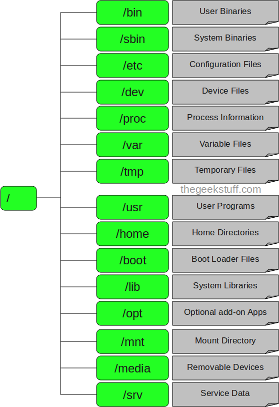
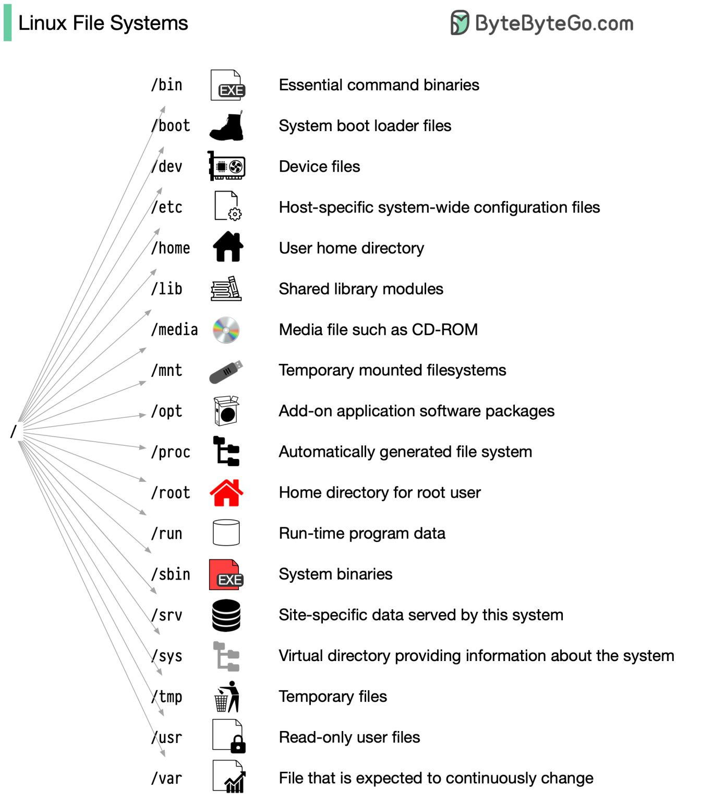

# My_Learning_Linux_essentials

Learn the LINUX hacks on Ubuntu

- **File Structure sytem on Linux**
<p align="left">
	
</p>



## Installation

### Operating System (OS)

- **Windows**: use Ubuntu via WSL.
  - Access linux-like terminal
    - `bash`
    - `git-bash`
- **Linux**: Any variant (Ubuntu, Linuxmint, Redhat....)
  - Access default terminal

### Package Installation

- Any package installation using `$ sudo apt get python3`
- Binary gets installed in this directory path: `/usr/bin/python3`
- check installation using `$ python3`
- Aliasing by some other name:
  - M-1: [RECOMMENDED]
    - open `bashrc` file: `$ nano ~/.bashrc`
    - add this in the end of file: `alias python=python3`

```console
$ python
Python 3.6.7 (default, Oct 22 2018, 11:32:17)
[GCC 8.2.0] on linux
Type "help", "copyright", "credits" or "license" for more information.
>>>
```

    - M-2:
    	+ type this in the terminal: `$ alias python=python3`
    	+ this gets added in the file: `~/.profile`

- Locate binary file of any package (say, `python3`):

```console
$ which python3
/usr/bin/python3
```

## Links

- The linux file structure - https://www.thegeekstuff.com/2010/09/linux-file-system-structure/
