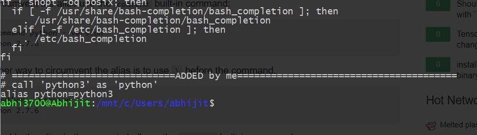
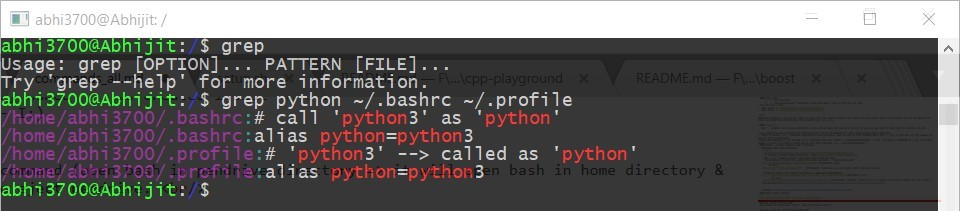
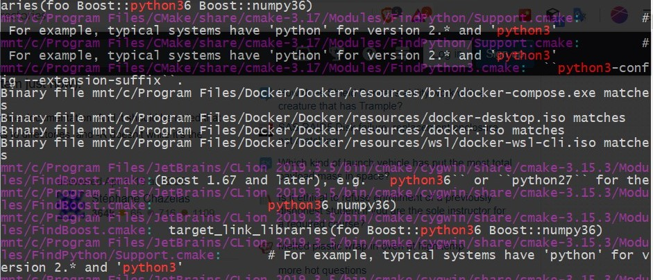
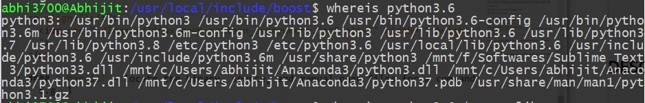
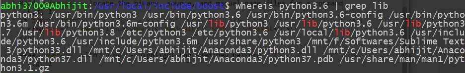

* Install a package: `sudo apt install python3`
* Remove a package: `sudo apt remove python3`
* Remove it's dependencies: `sudo apt autoremove`
* List installed packages: `apt list --installed`
* search for a particular installed package: `apt list --installed | grep git`
```console
$ apt list --installed | grep git

WARNING: apt does not have a stable CLI interface. Use with caution in scripts.

findutils/bionic,now 4.6.0+git+20170828-2 amd64 [installed]
git/bionic,now 1:2.26.2-0ppa1~ubuntu18.04.1 amd64 [installed]
git-man/bionic,now 1:2.26.2-0ppa1~ubuntu18.04.1 all [installed,automatic]
libicu-le-hb-dev/bionic,now 1.0.3+git161113-4 amd64 [installed,automatic]
libicu-le-hb0/bionic,now 1.0.3+git161113-4 amd64 [installed,automatic]
librtmp1/bionic,now 2.4+20151223.gitfa8646d.1-1 amd64 [installed,automatic]
net-tools/bionic,now 1.60+git20161116.90da8a0-1ubuntu1 amd64 [installed,automatic]
```
* #### root, home
		* `/`  -> root directory
		* `~`  -> "home/{user_name}/" directory, where user_name = name of the user say abhi.
* copy and move a file
	- copy using `cp source/location destination/location`
	- move using `mv source/location destination/location`

> NOTE: Although a file can be copied or moved into the Ubuntu folder in C:\ drive. But, one should not do that because it will not show in the folder in ubuntu file directories, when accessed via `bash-cmd`.

* `/etc` - contains configuration files.
* `/usr/local/etc` - this directory contains mostly downloaded files. 

* #### `uname -a`
	- **o/p** - displays the system architecture. Here, x86_64 means the system is 64-bit. If you will get i386 or i686 then the system is 32-bit. 
```console
Linux Abhijit 4.4.0-17134-Microsoft #137-Microsoft Thu Jun 14 18:46:00 PST 2018 x86_64 x86_64 x86_64 GNU/Linux
```
* NOTE: In linux, `bash` terminal, everything is case-sensitive. E.g. if want to find "NumpCpp.hpp", type `$ NumC` & then tab, it will appear, or else, it won't autocomplete.
* During installation of any package, it is extracted into this folder: __"/usr/local/include/"__, like __C:\ drive in Windows OS__. So, any custom package if wants to be added, please add it into this directory i.e. __"/usr/local/include"__

* #### Editor - Install Sublime Text 3 in Ubuntu
	- __Method-1: Only linux involved__
		+ `cd ~`
		+ `wget http://c758482.r82.cf2.rackcdn.com/sublime-text_build-3083_amd64.deb`
		+ if 'Unable to load libgdk-x11-2.0.so' , then `sudo apt-get install libgtk2.0-0`
		+ Now, `subl` command wouldn't work until added onto the path.
		+ the directory in which the sublime text gets installed - "/opt/sublime_text"
		+ `ln -s "/opt/sublime_text" /usr/local/bin/subl` [PERMANENT] <br/>
						OR <br/>
			`alias subl='"/opt/sublime_text"'`	 [TEMPORARY]  Temporary i.e. will exist within that bash window 
	
	- __Method-2: Access the sublime (installed in windows) [RECOMMENDED]__ 
		+ `ln -s "/mnt/f/Softwares/Sublime Text 3/subl.exe" /usr/local/bin/subl` [PERMANENT] <br/>
						OR <br/>
		+ `alias subl='"/mnt/f/Softwares/Sublime Text 3/subl.exe"'` [TEMPORARY]- fetching installed repo in windows from ubuntu through WSL due to the [Interoperability](https://blogs.msdn.microsoft.com/wsl/2016/10/19/windows-and-ubuntu-interoperability/) 	
		
	[SOURCE](http://docs.sublimetext.info/en/latest/getting_started/install.html)

* #### Seach Files, Folders
```
find Search-Directory-Path -name file-name-to-search

## only search for files ##
find Search-Directory-Path -type f -name file-name-to-search

## only search for directories/folders ##
find Search-Directory-Path -type d -name dir-name-to-search
```
	E.g.- 
	* `$ find /home/user/ -name xyz`
	* `$ sudo find / -name passwd`
	* `$ sudo find / -type f -name "birthday-party.mp4"`
	* `$ sudo find / -type f -name "*.mp4"`
	* `$ sudo find / -type f -iname "*.mp4"`
	* `$locate resume.pdf`
	
	[Source](https://www.cyberciti.biz/faq/linux-how-can-i-find-a-file-on-my-system/)
	
* #### PATH check
		* `echo $PATH` - with WSL, shows Ubuntu + windows environment variables.
		
* #### ```tree -L 1``` 


* #### ```tree -L 2```


* #### <kbd>ctrl+l</kbd> - clears the screen
* #### <kbd>ctrl+d</kbd> - logout 
* #### <kbd>ctrl + c</kbd> - Copy  [in bash (ubuntu via WSL)]
* #### <kbd>ctrl + shift + v</kbd> - Paste	[in bash (ubuntu via WSL)]
* #### `ls -a` - shows all the files including hidden ones.
* #### ```sudo apt-get update``` - Update the packages
* #### ```cd /``` - Go to the root 
* #### ```history -c``` - clears the screen, 
	```history``` - displays the history commands
* #### ```echo``` - prints the word 'hello' after 'echo'.
* #### ```hostname``` - prints the computer name
* #### ```date``` - prints the date
* #### ```bash --version``` - prints the bash's version
* #### ```cd ~``` - takes to the home directory
* #### `which cmake` - prints the location of the command. NOTE: only lists the binary. Also, don't bother about current directory, it searches globally.
* #### `tree` - shows the folder structure in tree picture.
* #### Opening the explorer within the bash shell like in windows cmd.
	```alias start='cmd.exe /c start'```
	 DONE!!.
	Now, open it through - 
	```start .```	

	 Note: it will not start an explorer on linux only files, but any mapped windows file systems will work.
	 **Source** - https://stackoverflow.com/questions/44245721/launching-explorer-from-wsl

* #### ```sudo nano [Filename]``` - Opens any type of file
	E.g. - ```sudo nano config.ini```
	
* #### `alias`
	- **NOTE: It doesn't work inside .sh files.**
	
	- E.g. call python3 as python in terminal
		+ `$ nano ~/.bashrc` - open ".bashrc" file in bash terminal
		+ `alias python=python3` - add this line in the file as shown below:

	<p align="left">
		
	</p>

	So, in case of any need, use it externally for the terminal, and then run the script.
	
* #### ln

	> NOTE: For shell script files, it's little different. 

	`$ sudo ln -s ~/scripts/eoscc.sh /usr/local/bin/eoscc`

* #### bash-profile
	`$ nano ~/.profile` - type in any directory location on Bash terminal.
	
	- Usages:
		+ It gets executed when the bash terminal is loaded.
		+ It is used as a PATH, meaning in order to search shortcuts from paths.

* #### Hidden files
	- These files starts with `.` character like `.profile` present in home location i.e. `~/.profile`

* #### Cryptographic Hash
	- `$ shasum -a 256 hello.txt` - gives SHA256 checksum.
	- [Reference](http://manpages.ubuntu.com/manpages/bionic/man1/shasum.1p.html)

* #### Install a `.deb` package
	- `$ sudo apt-get install ./EOSStudio-0.2.0.deb`

* #### `unexpected end of file` error in bash script
	- try to convert from dos format to unix for the shell file by using: `$ dos2unix setup.sh`
	- if `dos2unix` is not installed, then install using: `$ sudo apt-get install dos2unix`

* #### `ls` - shows the list w/o hidden files (starts with `.`)
```console
README.md
```

* #### `ls -l` - shows the list (with detailed data) w/o hidden files (starts with `.`)
```console
total 0
-rwxrwxrwx 1 abhijit abhijit 61 Mar 11 12:09 README.md
```

* #### `ls -a` - shows the list.
```console
.  ..  .git  README.md
```

* #### `ls -al` - shows the list (with detailed data)
```console
total 0
drwxrwxrwx 1 abhijit abhijit 4096 Mar 11 12:09 .
drwxrwxrwx 1 abhijit abhijit 4096 Mar 11 12:09 ..
drwxrwxrwx 1 abhijit abhijit 4096 Mar 11 12:09 .git
-rwxrwxrwx 1 abhijit abhijit   61 Mar 11 12:09 README.md
```

* #### Access removable disk on WSL Windows 10:
	- Follow the steps:
		+ `$ sudo mkdir /mnt/i` - Removable disk on Disk I:. So, a directory named `i` is created inside `mnt`.
		+ `$ sudo mount -t drvfs I: /mnt/i` - Mount removable media (e.g. - I:)
		+ `$ sudo umount /mnt/i` - Unmount removable media
	
	> NOTE: Just during first time (when inserted) run the `mount` command (open bash in pendrive directory => it will open bash in home directory & then just run `./mount.sh` ), & during unmount use the usual way to eject pendrive. <br/> 
	
	> [Tested OK]

* #### List all the installed compilers using
```console
dpkg --list | grep compiler
```

* Navigate to a directory with space
	- E.g. "C:\Program Files\mingw-w64"
```console
$ cd /mnt/c/Program\ Files/mingw-w64/
```
* #### `grep` - search a pattern in each file
	- `$ grep <pattern> <filenamewithext-1> <filenamewithext-2> <filenamewithext-3> ...`. A example shown below:

	<p align="left">
		
	</p>

* #### `grep` - search a pattern in active directory (in which you are present)
	- `$ grep python3 * -r`

	<p align="left">
		
	</p>

* #### `whereis` - locate the binary, source, and manual page files for a command
	- E.g. 1
	<p align="left">
		
	</p>

* #### `whereis` with `grep` - highlight the searched pattern
	- E.g. 1
	<p align="left">
		
	</p>

	> NOTE: It doesn't bother about the current directory, it searches globally always.


